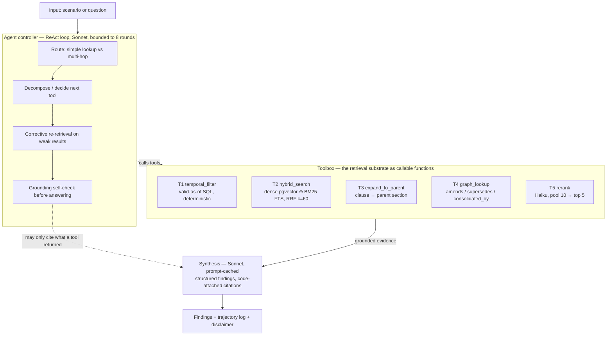

# Adjudicator — an agentic RAG prototype over SEBI compliance, and why I didn't ship it

*A regulatory-intelligence prototype over the public SEBI Stock-Broker corpus. Built as a learning
artifact and portfolio piece — **not** a product, and **not** legal advice. Every finding is for
expert review only.*

> **Disclaimer (non-removable).** Nothing here constitutes legal advice or a compliance
> determination. Every surfaced finding requires review by a qualified compliance professional and
> verification against the cited source circular.

---

## 1. The problem shape — why semantic similarity is not enough

A compliance question over regulation is not a lookup. Take a real one:

> *"Is our running-account settlement policy compliant as of today, and has anything changed in the
> underlying rules?"*

Answering it correctly requires four things a naive "embed the question, fetch top-k, summarise"
pipeline cannot do:

1. **Temporal validity.** An obligation that was authoritative in 2021 may have been superseded in
   2024. The *most semantically similar* passage is often the *superseded* one — similarity and
   validity are orthogonal.
2. **Multi-hop supersession.** The current position on running-account settlement is not in one
   circular; it is the consolidated result of a base circular → its amendments → a master circular
   that rescinded and re-stated them. You have to *follow the chain*.
3. **Citation-bound answers.** Every claim must trace to a specific source circular and clause. A
   fluent paraphrase with no citation is worse than useless here — it manufactures false confidence.
4. **Recall-first economics.** The worst failure in compliance is a **false negative**: a real
   obligation that is never retrieved, so a gap goes silent. That asymmetry drives every design
   choice below.

Semantic similarity gets you into the neighbourhood. It cannot tell you which obligation is *currently
valid*, cannot *trace an amendment*, and does not *cite*. That gap is the whole project.

---

## 2. Why agentic, not a pipeline — the amendment-miss story

The v1 of this project (a different repo) was a fixed hybrid **pipeline**: one retrieval, one ranking,
one synthesis. On the settlement question it would retrieve the settlement circular, rank it, and
answer — confidently, from the **first** thing it found. If a later amendment changed the settlement
cadence, the pipeline never looked for it. It had no step that asks *"is there something newer that
changes this?"* That is not a tuning bug; it is the shape of a pipeline.

An **agent** has that step. Given the same question it:

- **routes** the query as multi-hop (not a simple lookup);
- calls `temporal_filter` to scope the obligations valid *today*;
- calls `hybrid_search` to find the settlement obligation;
- calls `graph_lookup` to discover the master circular consolidated and superseded the base ones;
- calls `temporal_filter` again to confirm the superseding item is itself effective;
- `rerank`s for precision, then hands grounded evidence to synthesis.

The agentic claim is domain-justified, not decorative: SEBI questions are genuinely multi-step, and
the step a pipeline skips — *follow the chain* — is exactly where compliance correctness lives.

---

## 3. The architecture — a controller loop over five fine tools

The v1 pipeline stages did not disappear; they became **tools the agent calls**. A hand-rolled ReAct
loop (I own every line — ADR-002) decides, per step, which tool to invoke.

The interview-defensible core is not the diagram — it is **the decision table below**. Every real
decision is an ADR with the alternative named and the metric that settled it. The four columns are
pulled from the ADR files, not memory.

### ADR decision table (ADR-000 … ADR-020)

| ADR | Chosen | Rejected (one clause) | What we measure |
|---|---|---|---|
| **000** Problem & non-goals | Agentic RAG, recall-first, clean-slate repo | v1 fixed pipeline (misses amendments) | every phase gated on a `docs/metrics.md` metric |
| **001** Corpus boundary | Stock Brokers family | IA (too few supersession chains), LODR (too big to gold-label) | ≥ threshold obligations with resolved temporal metadata |
| **002** Agent framework | Hand-rolled Anthropic tool-loop | LangGraph (owns the loop), LlamaIndex (hides it) | trajectory correctness + end-answer recall |
| **003** Input modes | Scenario-only first | scenario+document at once (unproven engine) | finding P/R measured on scenarios first |
| **004** Embedding model | `text-embedding-3-small` @ 512-dim | larger models before a recall number justifies the cost | recall@k vs ≥1 alternative (EXP, keep/revert) |
| **005** Code module | Out of v1 (Phase 8 stretch) | in-scope now (would eat the core RAG learning) | if built: metadata-only, signals-not-code |
| **006** Citation graph | Narrow relations table + recursive SQL | GraphRAG / Neo4j (edges are already explicit in appendices) | relation-edge accuracy ≥ 95% vs source |
| **007** Chunk grain | Structure-aware clause chunks + parent links | whole-circular / fixed-window (shred legal structure) | recall@k; chunk grain a logged knob |
| **008** Corpus acquisition | Curated seed list (master circular 2024/110) | crawler (brittle; a bounded corpus is the point) | ingest idempotent (re-run ≠ duplicates) |
| **009** Extraction | LLM-assisted + human review (= gold seed) | pure-auto (unverifiable), pure-manual (no pipeline) | extraction accuracy vs hand-reviewed sample |
| **010** Contextual Retrieval | Build the hook; decide on/off by experiment | assume-on (violates the no-blind-knob rule) | contextual-on vs -off recall@k (keep/revert) |
| **011** Retrieval architecture | Hybrid candidate generation → Haiku rerank | pure-sparse (ranks poorly), naive hybrid (< dense here) | MRR 0.79 → **0.97** with rerank |
| **012** RRF constant | k = 60 (literature default) | tuning k (measured **flat** across 10–100) | logged no-op sweep (EXP-002) |
| **013** BM25 impl | Native Postgres FTS (`ts_rank_cd`) | ParadeDB/`pg_search` (op weight unjustified) | re-open only if exact-token recall is a bottleneck |
| **014** Reranker & pool | Haiku, pool 10 → top 5 | none/naive (leaves precision), cross-encoder (later) | recall@5 with pool=10; MRR/precision@1 |
| **015** Eval methodology | Offline metrics + LLM-judge (anchored) + custom trajectory log | LLM-judge where a deterministic metric exists | regression gate: recall@5 **0.99** at scale |
| **016** Agent design | Bounded (8 rounds) + 5 fine tools + grounding gate | unbounded agency, one coarse `search` tool | route/key-tool/overlap/correction/grounding metrics |
| **017** Grounded synthesis | Structured findings, **code-attached** citations, double grounding gate | LLM-supplied citations, free-text output | finding P/R, faithfulness, compliant-control = 0 |
| **018** Code module (Phase 8) | Signals-not-code, regex+AST, graceful without Semgrep | retaining source; hard Semgrep dependency | 9 signals → cited obligations on synthetic repo |
| **019** Two-tier recall | Deterministic pool gate (CI) + periodic post-rerank eval | rerank-in-CI (flaky/paid), pool-recall as proxy | post-rerank recall + **zero-drop** guarantee |
| **020** Model pins | Stay on `claude-sonnet-4-6` for v1; document Sonnet 5 path | blind swap to `claude-sonnet-5` (invalidates numbers) | before/after guarded EXP-007 on swap |

---

## 4. The honest numbers

All numbers below trace to an experiment log, a script output, or a gate result. Where a number was
measured on an earlier corpus snapshot, that is stated.

**Corpus (current).** 77 real obligations (+3 synthetic supersession fixtures for testing the graph),
24 typed relation edges (12 `consolidated_by`, 7 `refers_to`, 3 `amends`, 2 `supersedes`), all sourced
from the Aug-2024 Stock-Brokers Master Circular `SEBI/HO/MIRSD/MIRSD-PoD-1/P/CIR/2024/110`. *(Source:
`adj_obligation` / `adj_obligation_relations`, ADR-006/008.)*

**Retrieval — the deterministic CI gate** (`eval/regression_gate.py`, 35 golden queries, raw hybrid
pool, no rerank): **recall@5 0.99**, recall@3 0.84, recall@1 0.60, MRR 0.76. This is a *pool-recall*
tripwire — free, deterministic, and it guards against a silently missed obligation.

**Retrieval — what the agent actually consumes** (WI-1 / ADR-019, `eval/rerank_recall_eval.py`, same
35 queries, hybrid pool 10 → Haiku rerank → top-5):

| metric | raw-hybrid pool | post-rerank (what the agent sees) | delta |
|---|---|---|---|
| recall@1 | 0.60 | **0.91** | +0.31 |
| recall@3 | 0.84 | **1.00** | +0.16 |
| recall@5 | 0.99 | **1.00** | +0.01 |

**Zero rerank drops:** the reranker did not push a single gold obligation out of the top-5 that the
pool had retrieved — and on one query (Q18) it *recovered* a gold obligation from pool ranks 6–10 into
the top-5 (pool recall@5 0.50 → 1.00). This is the number the writeup's "recall-first" claim rests on,
and it is guarded by a periodic eval the CI gate structurally cannot see (that is the point of the
two-tier split, ADR-019).

**The framing that keeps this honest (ADR-011 status note, WI-2):** *rerank did the precision work;
hybrid is insurance, not a measured current-corpus win.* On this corpus naive hybrid (MRR 0.79 / 0.74
at 16 / 54 obligations) actually **underperforms** pure-dense (MRR 0.90 / 0.86) — RRF dilutes a strong
dense signal with noisier sparse ranks on a small, semantically-separable corpus (EXP-001, EXP-004).
The classic BM25 exact-term win doesn't even apply: chunks are paraphrased and carry no circular-number
tokens (ADR-013). Hybrid is kept as an insurance bet for corpus growth and exact-term robustness — to
be re-benchmarked, not claimed as a current win. **Rerank is the component that earns its cost**
(MRR 0.79 → 0.97, EXP-001/004).

**A discipline anecdote (EXP-002).** The RRF constant `k` was swept over {10, 30, 60, 100} and the
result was **completely flat** — every metric identical. It is logged as a deliberate no-op: a knob
that was measured and left alone, not tuned by vibes. Keeping k = 60 (the literature default) is a
defensible non-decision *because it was measured.*

**Synthesis / gap detection** (EXP-005 → EXP-006, ADR-017, 6 gold scenarios incl. one compliant
control): finding **recall 1.00**, citation faithfulness **1.00**, and precision **0.87** after a
second-pass adjudication (**EXP-006**) — up from a recall-first raw pass at ~0.72–0.76. Precision was
earned honestly and in stages: a first pass at 0.34 was traced to phantom findings and fixed with a
strict contradiction contract (→0.65→0.76, EXP-005); then a **strict second-pass reviewer** re-examines
each proposed finding and drops "merely topically related" ones (→0.87, EXP-006). The pass can only
*remove* findings, all three drops it made were correct (a non-gap obligation already covered by a more
direct finding), **recall stayed 1.00**, and the dropped candidates are surfaced as `rejected_findings`
with a reason — so the precision decision is **auditable, not asserted**.

**The agent's path (§7 trajectory eval, ADR-016, `scripts/run_agent_eval.py`, 4 gold trajectories):**
route accuracy **4/4**, key-tool accuracy **4/4** (it calls `graph_lookup` on the supersession
question), grounding-clean **4/4** (zero hallucinated obligation IDs). Corrective re-retrieval is the
one nondeterministic axis (3–4 of 4 across runs) — reported as such, not rounded up.

---

## 5. The grounding gate — the headline

This is the rarest, most valuable part of the build, so it gets its own beat.

An LLM asked to "find compliance gaps" will invent them. The v1 failure mode was a fluent report full
of obligations that were never retrieved. Adjudicator enforces grounding **twice**, in two different
places, in two different ways:

1. **Prompt-level** (both agent and synthesis): the model is told it may only cite obligations that a
   tool actually returned in this session — never invent an ID.
2. **Code-level** (the gate that actually holds): after the model answers, code filters its output
   against the set of obligation IDs the tools surfaced. Any ID the tools did not return is **dropped**
   before it can reach the user. The citation itself is attached in **code** from the obligation's real
   `source_circular_ref` + clause refs — the LLM never supplies a citation string (ADR-017).

The property this buys is testable, and it is tested: a **compliant scenario (S06) yields zero
findings.** No fallback that invents a gap to look useful; silence is a valid, correct answer. Across
the scenario eval, citation faithfulness is **1.00** — every emitted finding cited an obligation that
genuinely supports it. In a compliance tool, "it confidently made something up" is the failure that
matters most, and the double gate is what prevents it.

You can *watch* this in the **agent trajectory viewer** (`frontend/trajectory-viewer/`) — a static
page that replays a real run: the route badge, each tool call, the `graph_lookup` that traces the
supersession, and the grounding badge confirming nothing was dropped.

---

## 6. Why it stays a prototype — the most senior part

The rarest signal an engineer can show is *knowing why you didn't ship.* Adjudicator is deliberately a
prototype, and three structural reasons make a commercial version a bad idea:

1. **Liability.** A compliance tool that misses an obligation creates *regulatory risk for its user* —
   a false negative isn't a bug, it's the customer's enforcement exposure. Carrying that needs
   insurance, legal review, and certification a portfolio project has no business simulating.
2. **Content licensing.** Curated regulatory databases are a *defended, licensed market* (Thomson
   Reuters Regulatory Intelligence, Wolters Kluwer OneSumX). Shipping a curated obligation database as
   a product walks straight into it. This uses only **public** SEBI text and never redistributes the
   corpus as a standalone database.
3. **Entrenched incumbents.** The market is held by heavyweights with sales, compliance, and trust
   moats. Competing is not the goal; **demonstrating capability** is.

The prototype framing neutralises all three: nothing relies on it for real decisions (non-removable
disclaimer on every finding → defuses liability); public text, non-commercial, never redistributed →
defuses licensing; capability demonstration, not a market entrant → no competitive exposure.

---

## 7. Limitations and what's next

**Limitations (stated plainly).**
- **Scale:** 77 obligations, one regulation family (Stock Brokers). The engine is domain-agnostic; the
  demo corpus is deliberately bounded so the gold set stays hand-verifiable.
- **Single source family:** all obligations derive from one master circular; the supersession graph is
  seeded from its appendices plus synthetic fixtures that exercise the multi-hop path.
- **Nondeterminism:** synthesis precision fluctuates ~±0.05 run-to-run; corrective re-retrieval fires
  3–4 of 4. Reported honestly rather than cherry-picked.

**Built since the first draft.**
- **Document upload** as an input adapter (ADR-003 mode 2, `POST /analyze/document`): normalises to the
  same internal "practice assertions" the scenario path uses — a front-end adapter, not a new engine —
  with strict PII posture (processed in memory, **never persisted**; a test asserts it) and
  injection-hardening (uploaded text is treated as data, never as instructions).
- **The deferred experiments, now run and logged:** Contextual-Retrieval on/off (**EXP-007** — modest
  dense lift, off for v1, kept as a ready lever), an embedding bake-off `-3-small` vs `-3-large`
  (**EXP-008** — real dense-recall lift, no pipeline win, baseline kept), and a cross-encoder vs Haiku
  rerank (**EXP-009** — *identical* MRR 0.97 but ~26× faster, so Haiku stays and the cross-encoder is a
  measured latency lever). Common thread: the reranker already covers the early-rank recall these
  levers would add, so each is documented as a scale-time upgrade rather than a v1 change.

**Next (explicitly optional, gated).**
- **Model migration:** a guarded `claude-sonnet-4-6` → `claude-sonnet-5` swap (ADR-020), run as a
  before/after experiment and kept or reverted on the numbers — never a blind bump. Deliberately
  backlogged for v1 so every quoted number stays reproducible on the pinned model.

---

## The interview-defensible record

**21 ADRs** (every real decision, with the rejected alternative and the metric), **9 experiment logs**
(EXP-001…009 — including a genuine precision bug caught and fixed in EXP-005, a logged no-op in EXP-002,
and four keep/revert benchmarks that all resolved to "keep the lean baseline, here's the number"),
**trajectory logs**, gold datasets, a **two-tier recall gate**, and a static trajectory viewer. *No
knob was tuned without a metric attached.*

> **One line:** "I built an agentic RAG compliance prototype over public SEBI circulars, optimised
> against false negatives, evaluated on both its answer *and* its reasoning path — and I can tell you
> exactly why I chose not to make it a product."

*For expert review only. Not legal advice.*
